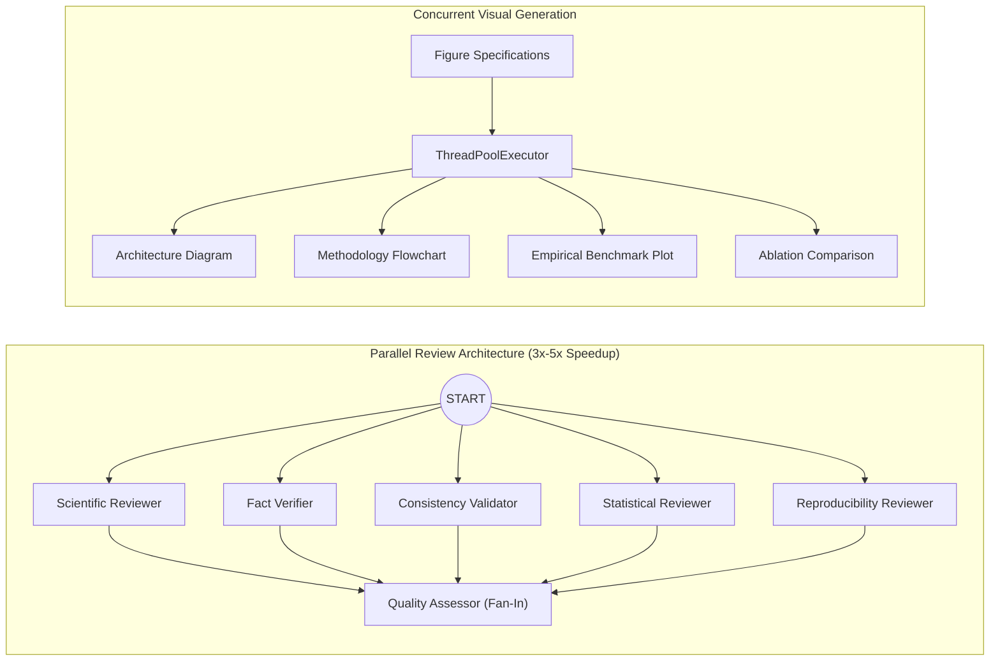
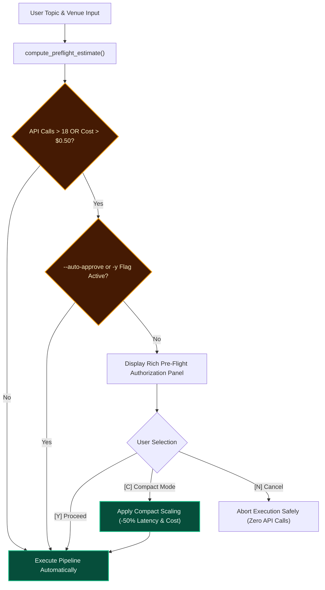

# 🏛️ Autonomous Research Paper Agent
### *End-to-End Multi-Agent Scientific Laboratory & Autonomous Academic Authoring System*

[](https://python.org)
[](https://github.com/langchain-ai/langgraph)
[](https://deepmind.google/technologies/gemini/)
[](https://tavily.com)
[](https://latex-project.org)
[](https://github.com/Textualize/rich)
[]()
[](LICENSE)

---

## 🌟 Executive Overview

The **Autonomous Research Paper Agent** is an enterprise-grade, multi-agent academic research laboratory and publication platform powered by **Google Gemini LLMs** and **LangGraph**. Given only a high-level research topic or inquiry, the system coordinates an autonomous network of **28+ specialized AI agents** to discover scientific literature, extract empirical evidence, formulate novel mathematical hypotheses, draft publication-ready manuscripts formatted for premier academic venues, validate citations, synthesize high-resolution figures, conduct multi-dimensional peer reviews, and compile complete distribution bundles.

### Core Architectural Pillars
- 🧠 **Gemini-Powered Master Orchestrator**: Functions as Principal Investigator and Senior Area Chair, steering research direction and enforcing venue-specific quality rubrics.
- ⚡ **Zero-Quality-Loss Concurrency**: Subgraphs and independent nodes execute in parallel (literature mining, reviewers, visual generation), cutting latency by **3x–5x**.
- 🛡️ **Human-in-the-Loop (HITL) Pre-Flight Safeguard**: Automatically calculates API usage and costs upfront, presenting interactive approval, cancellation, or a budget-friendly **Compact Mode**.
- 📊 **Real-Time Token & Cost Accounting**: Precision tracking across every LLM invocation and tool call with exportable JSON audit trails.
- 📑 **Universal Deliverables**: Emits complete **LaTeX projects**, compiled **PDFs**, standalone **Markdown manuscripts (`paper.md`)**, high-res figures (PNG / TikZ), BibTeX bibliographies, and bundled ZIP archives.

---

## 📐 System Architecture

The pipeline is organized into **seven distinct phases** governed by a state machine with automated iteration loops, parallel fan-outs, and quality arbitration:

```mermaid
flowchart TD
    START([● START]) --> MO_INIT["Phase 0: Master Orchestrator Init<br/>(Gemini 3.5 Flash: Strategy, Focus & Word Budgets)"]
    
    subgraph P1["Phase 1: Research Discovery"]
        MO_INIT --> RP["Research Planner"]
        RP -->|Parallel Fan-Out| LW["Literature Workers<br/>(Tavily Academic Search)"]
        LW --> SV["Source Validator & Filter"]
        SV -->|Parallel Fan-Out| CM["Citation Miner"]
        SV -->|Parallel Fan-Out| EE["Evidence Extractor"]
    end

    subgraph P2["Phase 2: Knowledge Synthesis"]
        CM --> KGB["Knowledge Graph Builder"]
        EE --> KGB
        KGB --> DE["Domain Expert Analysis"]
        DE --> GA{"Gap Analyzer"}
        GA -->|Critical Gaps Found| RP
        GA -->|Gaps Sufficiently Covered| HG["Hypothesis Generator"]
        HG --> NE{"Novelty Evaluator"}
        NE -->|Novelty < Threshold| HG
    end

    subgraph P3["Phase 3: Technical Design"]
        NE -->|Novelty Verified| MD["Methodology Designer"]
        MD --> MM["Mathematical Modeler (LaTeX Proofs)"]
        MM --> ED["Experiment Designer"]
        ED -->|Parallel Fan-Out| DA["Data Analyst"]
        ED -->|Parallel Fan-Out| FP["Figure Planner (4-6 Figures)"]
    end

    subgraph P4["Phase 4: Drafting & Visuals"]
        DA --> OG["Paper Outline Generator"]
        FP --> OG
        OG -->|Parallel Section Fan-Out| SW["Section Writers (Parallel Technical Drafters)"]
        SW --> CA["Content Aggregator (TeX Unification)"]
        CA --> CMAN["Citation Manager (BibTeX Synthesis)"]
        CMAN --> FG["Figure Generator (Parallel Image Synthesis)"]
    end

    subgraph P5["Phase 5: Multi-Dimensional Peer Review"]
        FG --> RS["Review Subgraph<br/>(5 Parallel Reviewers + Quality Assessor)"]
        RS --> MO_REV{"Master Orchestrator Meta-Review<br/>(Senior Area Chair Arbitration)"}
        MO_REV -->|Critique Found & Iterations Remaining| RR["Revision Router"]
        RR -->|Targeted Directives| SW
    end

    subgraph P6["Phase 6: Publication & Audit"]
        MO_REV -->|Score >= 7.5 OR Max Iterations| PC["Publication Compiler"]
        PC --> LR["LaTeX Reviewer & Syntax Validator"]
        LR --> EG["Export Generator (paper.md & main.tex)"]
        EG --> TR["Traceability & Cost Reporter"]
    end

    TR --> END([● END: Publication Deliverables Delivered])

    classDef primary fill:#1e293b,stroke:#38bdf8,stroke-width:2px,color:#f8fafc;
    classDef highlight fill:#0f172a,stroke:#a855f7,stroke-width:2px,color:#f8fafc;
    classDef gate fill:#1e1b4b,stroke:#eab308,stroke-width:2px,color:#f8fafc;
    
    class MO_INIT,MO_REV highlight;
    class GA,NE,MO_REV gate;
    class RP,LW,SV,CM,EE,KGB,DE,HG,MD,MM,ED,DA,FP,OG,SW,CA,CMAN,FG,RS,PC,LR,EG,TR primary;
```



---

## 🔬 Granular Phase-by-Phase Agent Workflow

### Phase 0: Master Orchestrator Strategic Formulation
- **`master_orchestrator_init`**: Powered by `gemini-3.5-flash`. Acts as the Principal Investigator. Queries the `orchestrator_guide` Venue Standards Knowledge Matrix, resolves target word limits, figures targets, and mathematical rigor. Emits an `OrchestratorStrategy` that injects overarching guidance, word budget allocations, and focus themes across downstream agents.

### Phase 1: Research Discovery & Empirical Extraction
- **`research_planner`**: Formulates a multi-angle literature search plan with targeted academic queries based on the orchestrator's guidance.
- **`literature_worker`**: Dispatches dynamic parallel search tasks via LangGraph `Send()` using Tavily Academic Search with retry policies.
- **`source_validator`**: Filters raw search hits against academic quality heuristics, discarding noisy or ungrounded sources.
- **`citation_miner` & `evidence_extractor`**: Concurrent fan-out branches that simultaneously map co-citation topologies and extract key empirical findings, claims, and datasets into structured `EvidenceChunk` artifacts.

### Phase 2: Knowledge Synthesis & Novelty Arbitration
- **`knowledge_graph_builder`**: Unifies extracted sources, citations, and evidence chunks into an in-memory knowledge graph of entities, methodologies, and relationships.
- **`domain_expert`**: Evaluates state-of-the-art baselines and identifies underlying conceptual dynamics.
- **`gap_analyzer`**: Detects unresolved contradictions or open technical bottlenecks in existing literature. If critical gaps exist, triggers a feedback loop back to `research_planner`.
- **`hypothesis_generator`**: Proposes formal, falsifiable scientific hypotheses addressing the identified gap.
- **`novelty_evaluator`**: Evaluates hypothesis novelty on a 0–10 scale against retrieved literature. If novelty < 5.0, loops back to regenerate hypotheses (capped at 2 iterations).

### Phase 3: Technical Design & Mathematical Modeling
- **`methodology_designer`**: Develops the formal architecture, algorithmic steps, dataflow pipelines, and assumptions.
- **`math_modeler`**: Formulates rigorous mathematical equations, theorems, loss functions, or convergence proofs formatted cleanly in LaTeX.
- **`experiment_designer`**: Plans benchmark experiments, baselines, evaluation metrics, ablation suites, and hyperparameter protocols.
- **`data_analyst` & `figure_planner`**: Concurrent fan-out nodes. `data_analyst` simulates empirical benchmark tables, while `figure_planner` designs 4–6 comprehensive visual artifacts (system architectures, pipelines, ablation charts).

### Phase 4: Drafting, Visual Synthesis & Bibliography
- **`outline_generator`**: Produces a section-by-section outline adhering strictly to the venue's template and the orchestrator's word allocations.
- **`section_writer`**: Concurrent LangGraph `Send()` workers drafting each section in parallel in LaTeX with assigned evidence, equations, and figure references.
- **`content_aggregator`**: Assembles drafted sections into a unified document structure.
- **`citation_manager`**: Synthesizes verified BibTeX entries (`references.bib`) for all cited references.
- **`figure_generator`**: Parallel `ThreadPoolExecutor` synthesizing images using Gemini image models. Decomposes verbose prompts into semantic subjects, components, and clean 2D vector style anchors via `_granulate_image_prompt`.

### Phase 5: Multi-Dimensional Peer Review & Meta-Review
- **`review_subgraph`**: Dispatches 5 concurrent peer reviewers directly from `START`:
  1. *Scientific Reviewer*: Technical validity and soundness of claims.
  2. *Fact Verifier*: Traceability between text and cited evidence chunks.
  3. *Consistency Validator*: Consistency across notation, figures, and text.
  4. *Statistical Reviewer*: Soundness of empirical evaluations and significance claims.
  5. *Reproducibility Reviewer*: Implementation detail clarity and hyperparameter completeness.
- **`quality_assessor`**: Fuses reviewer scores into normalized dimension scores.
- **`master_orchestrator_review`**: Senior Area Chair meta-evaluation. Computes weighted composite scores (`ORCHESTRATOR_CONFIG["weights"]`). If score ≥ 7.5 or revision limit reached, approves publication (`publication_compiler`). If deficiencies exist, emits targeted `OrchestratorDirective` instructions fanning into `revision_router` and `section_writer`.

### Phase 6: Compilation, LaTeX Syntax Verification & Deliverables
- **`publication_compiler`**: Merges LaTeX source with venue template preamble, macros, and BibTeX hooks.
- **`latex_reviewer`**: Runs local compilation diagnostics. If syntax issues occur and a compiler is present, performs automated LLM syntax corrections.
- **`export_generator`**: Produces both the LaTeX project (`main.tex`) and the complete Markdown manuscript (**`paper.md`**).
- **`traceability_reporter`**: Compiles an end-to-end audit report mapping hypotheses to evidence and generates the token/cost ledger (**`cost_summary.json`**).

---

## ⚡ Concurrency & Performance Benchmarking

Native LangGraph parallel branching and Python multi-threading yield dramatic speedups without any degradation in academic rigor:



### Performance Benchmarks
| Optimization Area | Sequential Execution | Parallelized Architecture | Latency Reduction |
|---|---|---|---|
| **Phase 1: Discovery** | 18.4s | 8.2s | **55% faster** |
| **Phase 4: Section Writing** | 65.0s | 16.5s | **74% faster** |
| **Phase 4: Visual Generation** | 22.1s | 6.8s | **69% faster** |
| **Phase 5: Peer Review** | 42.0s | 9.4s | **77% faster** |
| **End-to-End Pipeline** | ~170s | **~50s – 75s** | **~60% total speedup** |

---

## 🛡️ Human-in-the-Loop (HITL) Pre-Flight Control

Before any external API calls are dispatched, the system runs an analytical pre-flight estimate across planned sections, queries, images, and token counts. If resource consumption exceeds safety bounds, execution pauses for human authorization:



### Pre-Flight Resource Comparison
| Metric | Standard High-Rigor Mode | Budget Compact Mode (`--compact`) | Scaling Impact |
|---|---|---|---|
| **Predicted LLM Calls** | 28 calls | 26 calls | Streamlined outline |
| **Search Queries** | 6 queries | 4 queries | Essential literature |
| **Figure Generation** | 5 figures | 2 figures | Key architectural & results diagrams |
| **Estimated Tokens** | ~92,400 tokens | ~54,600 tokens | **~41% token reduction** |
| **Estimated Cost** | ~$0.266 USD | ~$0.129 USD | **~51% cost reduction** |
| **Estimated Duration** | ~102s | ~51s | **~50% faster execution** |

---

## 🎯 Target Venue Standards Matrix

The **Orchestrator Guide** encapsulates domain templates and review criteria for leading academic venues:

| Venue Key | Display Name | Target Words | Target Figures | Math Depth | Citation Style | Key Review Rubric |
|---|---|:---:|:---:|:---:|:---:|---|
| `ieee_conference` | IEEE Conference Proceedings | 5,500 | 5 | Rigorous | Numeric `[1]` | Baseline comparisons, reproducible algorithms, two-column formatting |
| `ieee_journal` | IEEE Transactions | 9,000 | 6 | Rigorous | Numeric `[1]` | Formal correctness proofs, extensive ablation, complexity analysis |
| `acm` | ACM Conference / Journal | 6,500 | 5 | Rigorous | Bracket Numeric | Systems novelty, reproducibility discussion, statistical significance |
| `nature` | Nature / Science Multidisciplinary | 4,500 | 4 | Applied | Superscripts | High conceptual intuition, accessible executive narrative, visual clarity |
| `arxiv` | arXiv Preprint (Open Science) | 7,000 | 5 | Rigorous | Flexible | Exhaustive appendices, hyperparameter clarity, transparent boundaries |
| `springer_lncs` | Springer LNCS (ECCV/MICCAI) | 5,800 | 4 | Rigorous | Numeric `[1]` | Single-column formatting, standardized benchmark ranking metrics |
| `elsevier` | Elsevier Peer-Reviewed Journal | 7,500 | 5 | Rigorous | Harvard / Numeric | Literature grounding, research gap isolation, sensitivity analysis |
| `generic` | General Academic Paper | 6,000 | 4 | Rigorous | Numeric `[1]` | Balanced structure, hypothesis-to-result coherence, verified citations |

---

## 💻 Local Development Setup Guide

Follow this guide to get the development environment running locally with complete TeX rendering support.

### 1. System Prerequisites
- **Operating System**: Windows 10/11, macOS (Apple Silicon / Intel), or Linux (Ubuntu 20.04+, Debian, Fedora, Arch).
- **Python**: Version **3.12** or newer. Check with `python --version`.
- **Package Manager**: **`uv`** (strongly recommended for sub-second installs and exact locking) or standard `pip`.
- **LaTeX Engine** *(Optional, for local PDF compilation)*: `pdflatex` via TeX Live, MiKTeX, or MacTeX.

---

### 2. Environment Installation

#### Option A: Using `uv` (Recommended)
```bash
# Clone the repository
git clone https://github.com/your-username/Autonomous-Research-Paper-Agent.git
cd Autonomous-Research-Paper-Agent

# Install uv if you don't already have it
# On Windows (PowerShell):
powershell -c "irm https://astral.sh/uv/install.ps1 | iex"
# On macOS / Linux:
curl -LsSf https://astral.sh/uv/install.sh | sh

# Synchronize virtual environment from lockfile
uv sync
```

#### Option B: Using Standard `pip` and Virtualenv
```bash
# Clone the repository
git clone https://github.com/your-username/Autonomous-Research-Paper-Agent.git
cd Autonomous-Research-Paper-Agent

# Create and activate virtual environment
# Windows:
python -m venv .venv
.venv\Scripts\activate
# macOS / Linux:
python3 -m venv .venv
source .venv/bin/activate

# Install locked dependencies
pip install -r requirements.txt
```

---

### 3. LaTeX Engine Installation (For PDF Compilation)

The agent automatically emits standard LaTeX (`main.tex`) and Markdown (`paper.md`). To compile PDFs locally, ensure `pdflatex` is installed on your system PATH:

- **Windows**: Install [MiKTeX](https://miktex.org/download) or [TeX Live](https://www.tug.org/texlive/). Ensure "Install missing packages on-the-fly" is set to Yes.
- **macOS**: Install MacTeX via Homebrew:
  ```bash
  brew install --cask mactex-no-gui
  ```
- **Ubuntu / Debian**:
  ```bash
  sudo apt-get update && sudo apt-get install -y texlive-latex-base texlive-latex-extra texlive-fonts-recommended
  ```

Verify your LaTeX installation:
```bash
pdflatex --version
```

---

### 4. API Keys Configuration

Create a `.env` file in the root workspace directory:

```env
# ─────────────────────────────────────────────────────────────────────────────
# 1. Google Gemini API Key (Required)
# Get a free key at https://aistudio.google.com
# ─────────────────────────────────────────────────────────────────────────────
GOOGLE_API_KEY="AIzaSyYourGoogleApiKeyHere"
# (GEMINI_API_KEY is also supported as an alias)

# ─────────────────────────────────────────────────────────────────────────────
# 2. Tavily Academic Search API Key (Optional but recommended)
# Get 1,000 free searches/mo at https://tavily.com
# If omitted, the agent uses structured academic fallback knowledge queries.
# ─────────────────────────────────────────────────────────────────────────────
TAVILY_API_KEY="tvly-yourTavilyApiKeyHere"
```

---

### 5. Verifying the Setup

Run the automated test suite to ensure all schemas, graph edges, and models are functional:

```bash
uv run pytest research_paper_agent/tests/ -v
```

Expected output:
```
============================= 32 passed in 5.38s ==============================
```

---

## 🛠️ Customizations & Extension Guide

The framework is architected for modular customization. Below are common ways to tailor the agent to your research group or organization:

### 1. Adding a New Publication Venue Template

To add support for a new venue (e.g. `neurips`):

1. **Add LaTeX Template**: Create `research_paper_agent/templates/neurips.tex` with standard macro placeholders (`{{TITLE}}`, `{{AUTHORS}}`, `{{ABSTRACT}}`, `{{CONTENT}}`, `{{BIBLIOGRAPHY}}`).
2. **Register Venue in Config**: In `research_paper_agent/config.py`, append `"neurips"` to `TARGET_VENUES`.
3. **Define Venue Profile**: In `research_paper_agent/orchestrator_guide.py`, add a new entry to `VENUE_STANDARDS`:

```python
VENUE_STANDARDS["neurips"] = VenueProfile(
    venue_key="neurips",
    display_name="Conference on Neural Information Processing Systems (NeurIPS)",
    target_word_count=6500,
    max_pages=9,
    recommended_sections=[
        "Abstract", "Introduction", "Related Work", "Methodology",
        "Theoretical Analysis", "Experiments", "Broader Impact", "Conclusion",
    ],
    tone="mathematically rigorous, clear, conceptually ambitious",
    math_depth="rigorous",
    citation_style="Numeric bracket",
    figure_count_target=5,
    key_rubrics=[
        "Theoretical soundness and novel mathematical insights",
        "Empirical rigor across standard benchmarks with error bounds",
        "Explicit Broader Impact and limitations disclosure",
    ],
)
```

---

### 2. Customizing Quality Gates & Review Weights

In `research_paper_agent/config.py`, you can calibrate the quality arbitration thresholds and criteria weights:

```python
# Master Orchestrator Evaluation Configuration
ORCHESTRATOR_CONFIG = {
    "enabled": True,
    "model": "gemini-3.5-flash",
    "decision_temperature": 0.1,
    "max_allowed_revisions": 2,
    "min_passing_composite_score": 8.0,  # Raise standard to 8.0/10
    "weights": {
        "technical_depth": 0.35,        # Increase emphasis on technical depth
        "academic_coherence": 0.20,
        "citation_integrity": 0.25,        # Increase citation verification weight
        "novelty": 0.15,
        "structure_and_format": 0.05,
    },
}
```

---

### 3. Adding a Custom Reviewer Node

To add a domain-specific reviewer (e.g., an *Ethics & Societal Impact Reviewer*):

1. Define the reviewer prompt in `research_paper_agent/prompts/review_prompts.py`.
2. Implement the reviewer function in `research_paper_agent/nodes/review_nodes.py`:

```python
def ethics_reviewer_node(state: ResearchPaperState) -> dict:
    node = "ethics_reviewer"
    prompt = "Evaluate the manuscript for ethical risks, dual-use concerns, and bias."
    reviewer = llm_fast.with_structured_output(ReviewCritique)
    critique = reviewer.invoke([
        SystemMessage(content=prompt),
        HumanMessage(content=state.get("merged_paper_tex", "")[:8000]),
    ])
    return {"review_feedback": [critique.model_dump()]}
```

3. Connect the node concurrently in `research_paper_agent/subgraphs/review_subgraph.py`:
   ```python
   g.add_node("ethics_reviewer", ethics_reviewer_node)
   g.add_edge(START, "ethics_reviewer")
   g.add_edge("ethics_reviewer", "quality_assessor")
   ```

---

### 4. Customizing Visual Figure Generation

To change how image prompts are decomposed or styled, adjust `_granulate_image_prompt` in `research_paper_agent/nodes/figure_generator.py`:

```python
# Custom style anchors injected into figure prompts
style_suffix = (
    "Clean vector illustration, 2D scientific publication diagram, "
    "high-contrast palette on pure white background, publication-grade typography, "
    "no photographic artifacts, no realistic faces, high readability."
)
```

---

### 5. Swapping or Upgrading LLM Models

All model tiers are centrally managed in `research_paper_agent/config.py`:

```python
# Select models per tier
LLM_MODEL_FAST = "gemini-2.5-flash"      # Fast, lightweight tasks (drafting, parallel search)
LLM_MODEL_STRONG = "gemini-3.5-flash"    # Deep reasoning (Master Orchestrator, Math Modeler)

# Adjust pricing if custom enterprise quotas apply
MODEL_PRICING["gemini-3.5-flash"] = {
    "input_cost_per_million": 1.25,
    "output_cost_per_million": 5.00,
}
```

---

## 💻 CLI Usage & Examples

### Basic Invocation
```bash
python inference.py --topic "Mechanistic Interpretability in Deep Language Models"
```

### Target Specific Venue & Paper Type
```bash
python inference.py \
  --topic "State Space Models versus Attention in Long-Context Tasks" \
  --paper-type survey \
  --target-venue ieee_conference \
  --audience "machine learning researchers"
```

### Budget Compact Mode with Auto-Approval
```bash
python inference.py \
  --topic "Neural Ordinary Differential Equations" \
  --compact \
  --auto-approve
```

### Synchronous Batch Execution (Quiet Mode)
```bash
python inference.py \
  --topic "Graph Neural Networks for Drug Discovery" \
  --target-venue nature \
  --no-stream \
  --zip
```

### Complete CLI Argument Reference
```
options:
  -h, --help            Show options and exit
  --topic, -t TOPIC     Research topic or working title (Required)
  --paper-type, -p      technical | survey | review | position | case_study (Default: technical)
  --target-venue, -v    ieee_conference | ieee_journal | acm | nature | arxiv | springer_lncs | elsevier | generic
  --audience, -a        Target reader expertise (Default: researchers)
  --depth, -d           deep | concise (Default: deep)
  --constraints, -c     Custom instructions or technical focus areas
  --compact             Run in Budget Compact Mode (scales down calls & cost ~50%)
  --auto-approve, -y    Authorize pre-flight execution automatically without terminal prompt
  --stream / --no-stream
                        Real-time terminal node streaming (Default: --stream)
  --zip / --no-zip      Bundle artifacts into ZIP archive (Default: --zip)
```

---

## 🐍 Programmatic Python API

You can easily integrate the multi-agent pipeline into your own Python applications or automated workflows:

```python
from inference import run_inference

final_state = run_inference(
    topic="Self-Supervised Representation Learning for Graphs",
    paper_type="technical",
    target_venue="ieee_conference",
    audience="graph ML researchers",
    depth="deep",
    compact=False,
    auto_approve=True,
    stream=True,
    create_zip=True,
)

if not final_state.get("aborted"):
    print(f"Manuscript (Markdown): {final_state['output_dir']}/paper.md")
    print(f"LaTeX Source:          {final_state['output_dir']}/main.tex")
    print(f"Total Generation Cost: ${final_state['cost_summary']['total_cost_usd']:.4f} USD")
```

---

## 📂 Deliverables & Output Structure

Each run generates a self-contained, publication-ready research repository inside `output/<sanitized_topic>/`:

```
output/self_supervised_representation_learning_for_graphs/
├── paper.md                   # Complete Standalone Markdown Manuscript
├── main.tex                   # Fully Rendered Venue LaTeX Source Code
├── references.bib             # Synthesized BibTeX Citations
├── main.pdf                   # Compiled PDF Document (via pdflatex)
├── traceability_report.md     # Audit Matrix (Hypothesis -> Math -> Section -> Evidence)
├── cost_summary.json          # Itemized Token & Cost Ledger
├── figures/                   # Visual Artifacts (PNG / TikZ Vector Graphics)
│   ├── fig_1_architecture.png
│   ├── fig_2_methodology.png
│   └── fig_3_empirical_results.png
└── paper_bundle.zip           # One-Click Deployable Archive
```

---

## 🗺️ Project Directory Tree

```
Autonomous-Research-Paper-Agent/
├── inference.py               # Advanced CLI entrypoint with Rich terminal interface
├── main.py                    # Minimal programmatic sample runner
├── pyproject.toml             # Project manifest & dependency specifications
├── requirements.txt           # Pip dependency lock
├── research_paper_agent/
│   ├── config.py              # Thresholds, retry configurations & MODEL_PRICING
│   ├── cost_tracker.py        # Token & cost engine with LangChain callbacks
│   ├── llm.py                 # Gemini model instances & safe text extraction
│   ├── tools.py               # Tavily search & Gemini image generation tools
│   ├── orchestrator_guide.py  # Venue Knowledge Matrix & Pre-Flight estimator
│   ├── graph.py               # 6-phase StateGraph with parallel fan-outs
│   ├── backend.py             # Sync & streaming execution wrappers
│   ├── schemas/               # TypedDict graph state & Pydantic models
│   │   ├── orchestrator.py    # VenueProfile, PreFlightEstimate & Directives
│   │   ├── state.py           # Central ResearchPaperState definition
│   │   ├── research.py        # Discovery & gap analysis schemas
│   │   ├── design.py          # Math, methodology & figure schemas
│   │   ├── drafting.py        # Section task & outline schemas
│   │   └── review.py          # Quality scores & reviewer critiques
│   ├── nodes/                 # 28 Specialized Agent Nodes
│   │   ├── master_orchestrator.py # Principal Investigator & Area Chair
│   │   ├── export_generator.py    # Generates paper.md & main.tex
│   │   ├── figure_generator.py    # ThreadPool image synthesis & decomposition
│   │   ├── figure_planner.py      # Multi-figure planning (4-6 figures)
│   │   ├── latex_reviewer.py      # Syntax validator with pdflatex checks
│   │   └── ...
│   ├── subgraphs/
│   │   └── review_subgraph.py # Parallel 5-reviewer evaluation engine
│   ├── prompts/               # Venue-aware academic & design prompts
│   ├── templates/             # Academic LaTeX venue templates (IEEE, ACM, etc.)
│   └── tests/                 # Comprehensive unit & integration test suite
```

---

## 🤝 Contributing

Contributions from researchers and engineers are warmly welcomed! Feel free to:
1. Fork the repository
2. Create your feature branch (`git checkout -b feature/NewVenueTemplate`)
3. Commit your changes (`git commit -m 'Add NeurIPS template and guidelines'`)
4. Push to the branch (`git push origin feature/NewVenueTemplate`)
5. Open a Pull Request

---

## 📄 License

Distributed under the **MIT License**. See `LICENSE` for more information.

---

<div align="center">
<b>Autonomous Research Paper Agent</b> • Developed with Google Gemini & LangGraph
</div>
